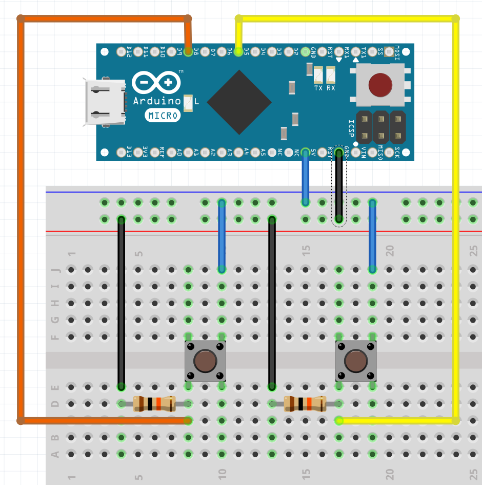

# zoom-controller

This repo contains the code to mute/unmute and start/stop video in Zoom by using an Arduino

This project requires:

- 1 x Arduino Micro (ATmega32U4)
- 2 x Push buttons
- 2 x 10K ohm resistors
- Wires / Breadboard

Schematic:

